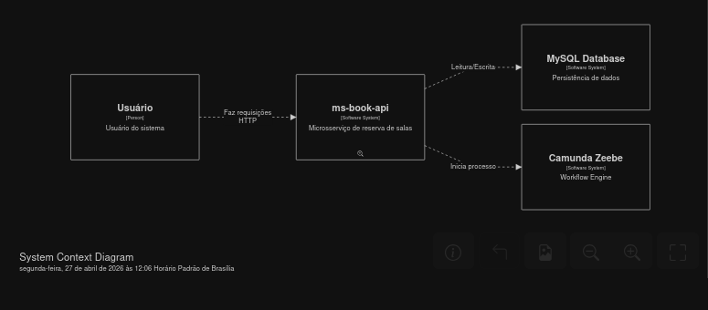

# MS-Book-API (Quarkus + Camunda)

Library management microservice with workflow orchestration using Camunda 8/Zeebe.

## ⚠️ License

**This project is for viewing and study purposes only.**

This project is for viewing and study only. Code cannot be copied, modified, distributed, or used commercially.

© 2026 Fernandes Silva. All Rights Reserved.

---

## About The Project

**MS-Book-API** is a microservice developed to manage a digital library, allowing registration and querying of books, authors, categories, publishers and users. The system also manages book loans using **Camunda Zeebe** for workflow orchestration, ensuring traceability and process automation.

### Project Objectives

- ✅ Provide a complete REST API for library management
- ✅ Implement process orchestration with Camunda Zeebe
- ✅ Apply best development practices (Hexagonal Architecture)
- ✅ Ensure interactive documentation with Swagger/OpenAPI
- ✅ Provide containerization with Docker for easy deployment

---

## Technologies

The project was developed using the following technology stack:

| Technology | Version | Purpose |
|------------|---------|---------|
| **Java** | 21 | Main language |
| **Quarkus** | 3.10+ | Cloud-native framework |
| **Camunda Zeebe** | 8.5+ | Workflow orchestration |
| **MySQL** | 8.0 | Relational database |
| **Hibernate Panache** | - | ORM and persistence |
| **OpenAPI Generator** | 7.0+ | API stub generation |
| **Docker** | - | Containerization |
| **Maven** | 3.9+ | Dependency management |

### Architecture Pattern

The project follows the principles of **Hexagonal Architecture** (Ports & Adapters), which promotes the isolation of business logic (domain) from external technologies.


**Hexagonal Architecture Layers:**

| Layer | Description |
|-------|-------------|
| **Domain** | Core business logic, entities, and rules (no external dependencies) |
| **Application** | Use cases that orchestrate domain entities |
| **Adapters** | Convert external input/output to domain format (REST, Database, Zeebe) |
| **Ports** | Interfaces that define how external world communicates with the core |

---

## Features

- 📚 **Book CRUD** - Register, query, update and delete books
- 👤 **Author CRUD** - Author management with biography and nationality
- 🏷️ **Category CRUD** - Book classification by category
- 🏢 **Publisher CRUD** - Publisher management (CNPJ, location)
- 👥 **User CRUD** - Library user registration
- 📋 **Loans** - Complete workflow with Zeebe orchestration
- ⭐ **Reviews** - Users rate books with scores
- 📊 **API First** - API-oriented design (OpenAPI/Swagger)
- 🔄 **Event-Driven** - Workers process asynchronous tasks
- 🐳 **Dockerized** - Easy deployment with containers
- ☸ **Kubernetes Ready** - K8s manifests included

---

## Architecture

### System Context Diagram



*Figure 1: System Context Diagram using C4 notation*

**Components:**

| Component | Description |
|-----------|-------------|
| **User** | Person who makes HTTP requests |
| **ms-book-api** | Library management microservice |
| **MySQL Database** | Database for persistence (read/write) |
| **Camunda Zeebe** | Workflow Engine for process orchestration |

**Data Flow:**

1. User → ms-book-api: HTTP requests (REST API)
2. ms-book-api → MySQL: Read/write data
3. ms-book-api → Camunda Zeebe: Starts workflow process

---

## Prerequisites

- **Java 21** - Programming language
- **Maven 3.9+** - Dependency manager
- **Docker and Docker Compose** - For containerized execution
- **MySQL 8.0** - Database (if running locally)
- **Git** - To clone the repository

---

## How to Run

### Option 1: With Docker Compose (Recommended)

```bash
# 1. Clone the repository
git clone https://github.com/fernandesgs10/ms-book-api.git
cd ms-book-api

# 2. Start all services (MySQL, Zeebe and API)
docker-compose up --build

# 3. Access services:
#    - API: http://localhost:8080
#    - Swagger UI: http://localhost:8080/swagger-ui
#    - Health Check: http://localhost:8080/q/health